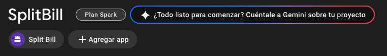
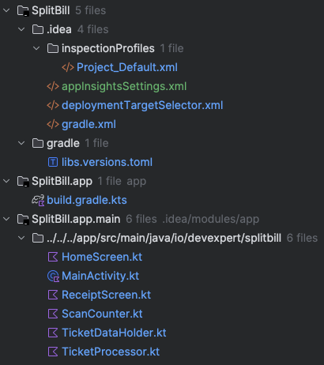
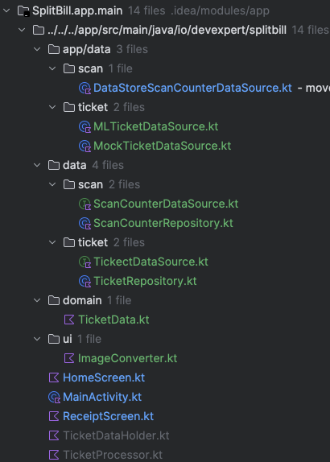
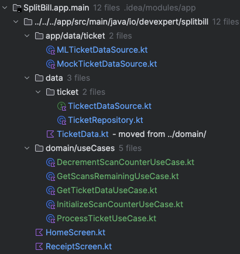
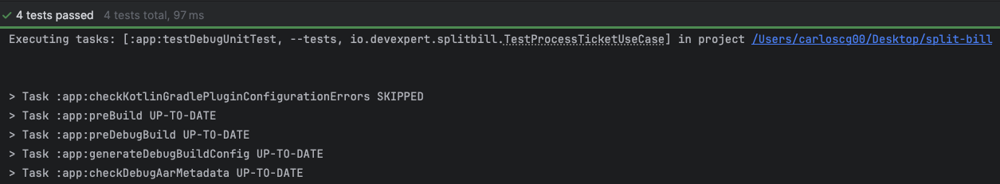
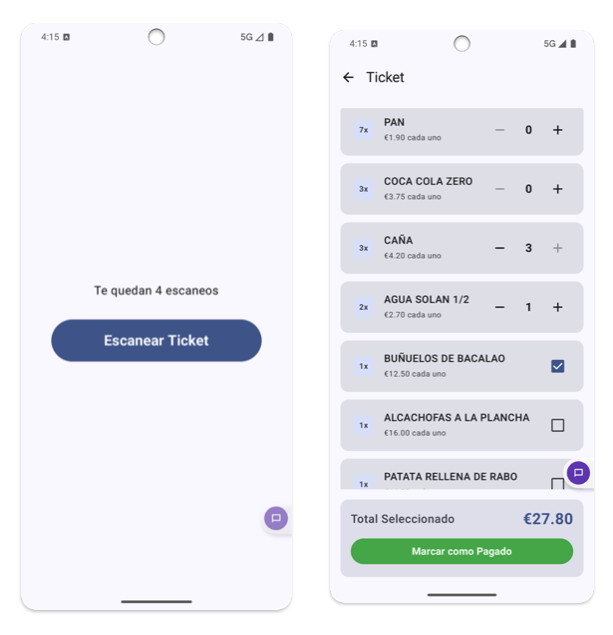

# RAMA GIT -> DIAS REALIZADOS

[ IMAGEN -> CAPTURA DE COMMIT GIT ]

[ RESULTADO FINAL PARA VER EN EMULADOR O DISPOSITIVO ANDROID ]

## DIA 1 (commit "dia 0")

Configuración de mi firebase obteniendo el "google-services.json" [ IMAGEN -> CAPTURA DE FIREBASE ]

Se han eliminado los warnings, espacios y comentarios innecesarios en el proyecto:
1. en el build.gradle (app) -> warning
2. en el mainactivity -> comentarios y espacios
3. en el HomeScreen y ReceiptScreen -> warning y comentarios
4. en el ScanCounter y TicketDataHolder -> warning (eliminado funciones innecesarias)
5. en el TicketProcessor -> warning

Actualizado todas las librerias y dependencias a su última versión. 
1. en libs.versions.toml

## DIA 2 (commit "dia 1-2 Capa de datos")

He creado la estructura dle proyecto siguiendo la arquitectura limpia (Clean Architecture) con las cparteas de datos, dominio y presentación. Pero solo con implementación de la capa de datos.
1.  Modulo data con carpetas scan y receipt
En cada carpeta se encuentra los ficheros de data source y repositorio. El modelo de datos  (TicketData) en un principio lo he sacado fuera.
2. Modulo app/data con carpetas scan y receipt
En cada carpeta se encuentra las implementaciones de los data source, en caso de ticket con la implementación real y a un mock para pruebas.
3. Ficheros sueltos de la activity y pantallas (HomeScreen y ReceiptScreen) los he modifado para su funcionamiento con la nueva estructura llamando al repositorio.

## DIA 3 (commit "dia 2-3 Capa de dominio (casos de uso)")
Trata de implementar la capa de dominio con los casos de uso (use cases) para manejar la lógica de negocio de la aplicación.

1. Antes de todo he movido el modelo de datos (TicketData) a la capa de data que es donde le correspondia.
2. En el modulo domain he creado las carpetas useCases directacmente con cada caso de uso sin necesidad de pasar por una interfaz para hacerlo más sencillo.
3. He modificado la implementación de la capa de presentación (pantallas) para que utilicen los casos de uso en lugar de interactuar directamente con el repositorio.
4. He modificado la activity principal para que pase los casos de uso necesarios a través del constructor.

## DIA 4 (commit "dia 3-4 La UI Inteligente (ViewModel y UDF (Unidirectional Data Flow))")
Implementación de la capa de presentación con ViewModel y UDF (Unidirectional Data Flow) para gestionar el estado de la UI de manera reactiva y mantener una separación clara entre la lógica de negocio y la interfaz de usuario.

1. He creado los ViewModel para cada pantalla (HomeViewModel y ReceiptViewModel) que se encargan de manejar el estado de la UI y exponer los datos a través de StateFlow.
2. He modificado las pantallas (HomeScreen y ReceiptScreen) para que observen los StateFlow del ViewModel y actualicen la UI en consecuencia.
3. A traves de uiState con unos valores como loading, error y data he conseguido gestionar los diferentes estados de la UI de manera reactiva.
4. He divivido en difentes ficheros y componentes la UI para hacerla más modular y reutilizable para el listado de tickets.
5. He modificado la activity principal para que utilice los ViewModel y pase los casos de uso necesarios a través del constructor.

## DIA 5 (commit "dia 5 Inyección de Dependencias y Testing")
Implementación de la inyección de dependencias de forma manual (sin librerias como Koin o Hilt) para gestionar las dependencias de manera eficiente y facilitar las pruebas unitarias.
1. Creación de un nuevo paquete di "di" en el módulo app para definir los módulos y proporcionar las dependencias necesarias, dentor creo un objeto AppModule.
2. Modificación de la MainActivity para que utilice las dependencias proporcionadas por el AppModule en lugar de crear instancias directamente.
3. En las pantallas he modificado la forma de obtener los ViewModel para que utilicen las dependencias inyectadas (que se proporicionan desde la MainActivity).
4. Creación de pruebas unitarias para los casos de uso y los ViewModel.
5. He añadido en el gradle la dependencia: testImplementation(libs.kotlinx.coroutines.test)
6. He creado test como:
- Verificar que se procesan todos los ítems
- Verificar un ítem concreto (integridad de datos)
- Validar que el total coincide con la suma de todos los ítems.

## DIA 5 (commit "Final Nuevas mejoras y README.md")
- CAMBIOS NUEVOS:
  - Cambiado de nombre de "ui" a "presentation" y de "TicketData" por "Ticket" (a secas)
  - Strings en resources (strings.xml) cambiar a plural resources
  - Revisión de carpetas


# 📱 SplitBill – Desarrollo paso a paso

[]()
[]()
[]()

Proyecto del reto de arquitectura de Antonio Leiva en **Android (Kotlin + Jetpack Compose)** siguiendo **Clean Architecture** y aplicando buenas prácticas de:
- ✅ Separación de capas (data, domain, presentation)
- ✅ Uso de DB de DataStore (persistencia local)
- ✅ Inyección de dependencias manual (sin librerías externas, excepto Firebase)
- ✅ Uso de ViewModel + UDF (Unidirectional Data Flow)
- ✅ Tests unitarios con `kotlinx.coroutines.test`

---

## 🚀 Progreso del Proyecto (por días / commits)

### 📌 Día 1 – *(commit: `dia 0`)*
🔹 **Configuración inicial del proyecto**
- Integración con **Firebase** (`google-services.json`)
- Eliminación de *warnings*, comentarios y código innecesario
- Actualización de todas las librerías en `libs.versions.toml`

📷 Ejemplo:  
  


---

### 📌 Día 2 – *(commit: `dia 1-2 Capa de datos`)*
🔹 **Estructura de Clean Architecture (solo capa de datos):**
- 📂 `data/scan` y `data/ticket` → data sources y repositorios
- 📂 `app/data/...` → implementación real y mocks
- Modificación de las pantallas (`HomeScreen`, `ReceiptScreen`) para consumir el repositorio

📷 Ejemplo:  


---

### 📌 Día 3 – *(commit: `dia 2-3 Capa de dominio`)*
🔹 **Implementación de la capa de dominio (use cases):**
- Modelo `TicketData` movido a `data`
- 📂 `domain/useCases` con lógica de negocio
- Pantallas actualizadas para llamar a casos de uso en vez de repositorios
- `MainActivity` pasa los casos de uso por constructor

---

### 📌 Día 4 – *(commit: `dia 3-4 UI Inteligente`)*
🔹 **Capa de presentación con ViewModel + UDF:**
- `HomeViewModel` y `ReceiptViewModel` usando `StateFlow`
- Pantallas observando `uiState` (`loading`, `error`, `data`)
- UI modular y reutilizable para lista de tickets
- `MainActivity` conecta dependencias y ViewModels

📷 Ejemplo:  


---

### 📌 Día 5 – *(commit: `dia 5 Inyección de dependencias y Testing`)*
🔹 **Inyección manual de dependencias + Tests unitarios:**
- 📂 `di/AppModule` con dependencias manuales de la app
- ViewModels inyectados desde `MainActivity`
- Tests (4) de casos de uso y ViewModels con `runTest`
 
🧪 Tests incluidos:
- Verificar número de ítems procesados
- Validar integridad de un ítem
- Comprobar que el total coincide con la suma de ítems
- Procesar un ticket mock y comprobar que el **total esperado (272.20)** es correcto

📷 Ejemplo test:  


---

### 📌 Día 6 – *(commit: `Final mejoras + README.md`)*
🔹 **Últimos cambios y limpieza:**
- Carpeta `ui` → renombrada a `presentation`
- `TicketData` → renombrado a `Ticket`
- Strings movidos a `strings.xml` con **plurals**

---

## 📲 Resultado final
Ejecutable en **emulador o dispositivo Android real**  
📷  


---

## 📂 Estructura final del proyecto
```bash
app/
 ├── app/
 │   ├── data/
 │   │   ├── scan/
 │   │   └── ticket/
 ├── data/
 │   ├── scan/
 │   └── ticket/
 ├── di/
 ├── domain/
 │   └── useCases/
 ├── presentation/
 │   ├── home/
 │   ├── receipt/
 │   └── theme/
 └── MainActivity.kt